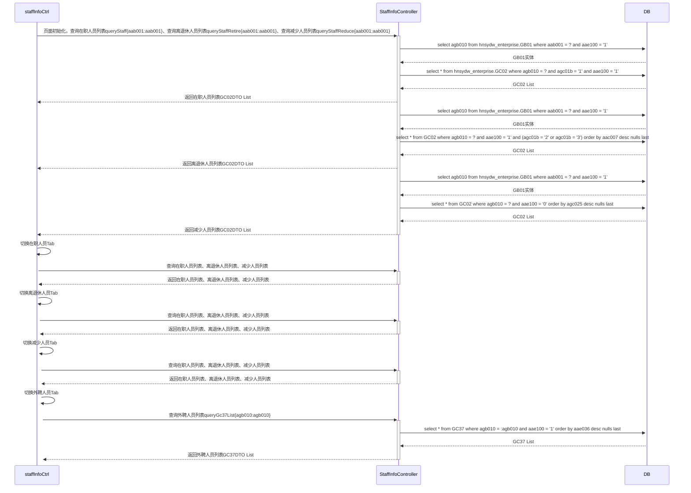

```mermaid
sequenceDiagram
    staffInfoCtrl->>+StaffInfoController:页面初始化，查询在职人员列表queryStaff{aab001:aab001}、查询离退休人员列表queryStaffRetire{aab001:aab001}、查询减少人员列表queryStaffReduce{aab001:aab001}
    
    StaffInfoController->>+DB:select agb010 from hnsydw_enterprise.GB01 where aab001 = ? and aae100 = '1'
    DB-->>StaffInfoController:GB01实体
    StaffInfoController->>+DB:select * from hnsydw_enterprise.GC02 where agb010 = ? and agc01b = '1' and aae100 = '1'
    DB-->>StaffInfoController:GC02 List
    StaffInfoController-->>staffInfoCtrl:返回在职人员列表GC02DTO List
    
    StaffInfoController->>+DB:select agb010 from hnsydw_enterprise.GB01 where aab001 = ? and aae100 = '1'
    DB-->>StaffInfoController:GB01实体
    StaffInfoController->>+DB:select * from GC02 where agb010 = ? and aae100 = '1' and (agc01b = '2' or agc01b = '3') order by aac007 desc nulls last 
    DB-->>StaffInfoController:GC02 List
    StaffInfoController-->>staffInfoCtrl:返回离退休人员列表GC02DTO List

    StaffInfoController->>+DB:select agb010 from hnsydw_enterprise.GB01 where aab001 = ? and aae100 = '1'
    DB-->>StaffInfoController:GB01实体
    StaffInfoController->>+DB:select * from GC02 where agb010 = ? and aae100 = '0' order by agc025 desc nulls last 
    DB-->>StaffInfoController:GC02 List
    StaffInfoController-->>-staffInfoCtrl:返回减少人员列表GC02DTO List

    staffInfoCtrl->>+staffInfoCtrl:切换在职人员Tab
    staffInfoCtrl->>+StaffInfoController:查询在职人员列表、离退休人员列表、减少人员列表
    StaffInfoController-->>-staffInfoCtrl:返回在职人员列表、离退休人员列表、减少人员列表
    staffInfoCtrl->>+staffInfoCtrl:切换离退休人员Tab
    staffInfoCtrl->>+StaffInfoController:查询在职人员列表、离退休人员列表、减少人员列表
    StaffInfoController-->>-staffInfoCtrl:返回在职人员列表、离退休人员列表、减少人员列表
    staffInfoCtrl->>+staffInfoCtrl:切换减少人员Tab
    staffInfoCtrl->>+StaffInfoController:查询在职人员列表、离退休人员列表、减少人员列表
    StaffInfoController-->>-staffInfoCtrl:返回在职人员列表、离退休人员列表、减少人员列表
    staffInfoCtrl->>+staffInfoCtrl:切换外聘人员Tab
    staffInfoCtrl->>+StaffInfoController:查询外聘人员列表queryGc37List{agb010:agb010}
    StaffInfoController->>+DB:select * from GC37 where agb010 = :agb010 and aae100 = '1' order by aae036 desc nulls last
    DB-->>StaffInfoController:GC37 List 
    StaffInfoController-->>-staffInfoCtrl:返回外聘人员列表GC37DTO List
```