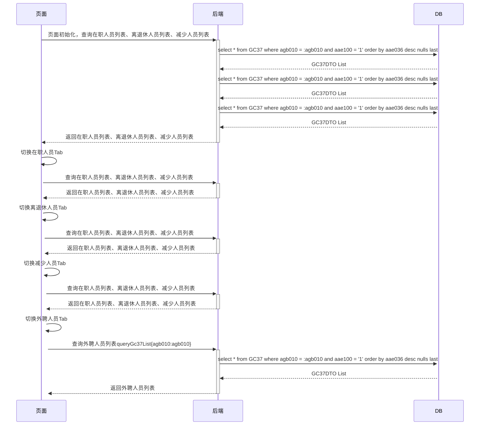

```mermaid
sequenceDiagram
    页面->>+后端: 页面初始化，查询在职人员列表、离退休人员列表、减少人员列表
    后端->>+DB:select * from GC37 where agb010 = :agb010 and aae100 = '1' order by aae036 desc nulls last
    DB-->>后端:GC37DTO List
    后端->>+DB:select * from GC37 where agb010 = :agb010 and aae100 = '1' order by aae036 desc nulls last
    DB-->>后端:GC37DTO List
    后端->>+DB:select * from GC37 where agb010 = :agb010 and aae100 = '1' order by aae036 desc nulls last
    
    
    DB-->>后端:GC37DTO List
    后端-->>-页面:返回在职人员列表、离退休人员列表、减少人员列表
    页面->>+页面:切换在职人员Tab
    页面->>+后端:查询在职人员列表、离退休人员列表、减少人员列表
    后端-->>-页面:返回在职人员列表、离退休人员列表、减少人员列表
    页面->>+页面:切换离退休人员Tab
    页面->>+后端:查询在职人员列表、离退休人员列表、减少人员列表
    后端-->>-页面:返回在职人员列表、离退休人员列表、减少人员列表
    页面->>+页面:切换减少人员Tab
    页面->>+后端:查询在职人员列表、离退休人员列表、减少人员列表
    后端-->>-页面:返回在职人员列表、离退休人员列表、减少人员列表
    页面->>+页面:切换外聘人员Tab
    页面->>+后端:查询外聘人员列表queryGc37List{agb010:agb010}
    后端->>+DB:select * from GC37 where agb010 = :agb010 and aae100 = '1' order by aae036 desc nulls last
    DB-->>后端:GC37DTO List 
    后端-->>-页面:返回外聘人员列表
```