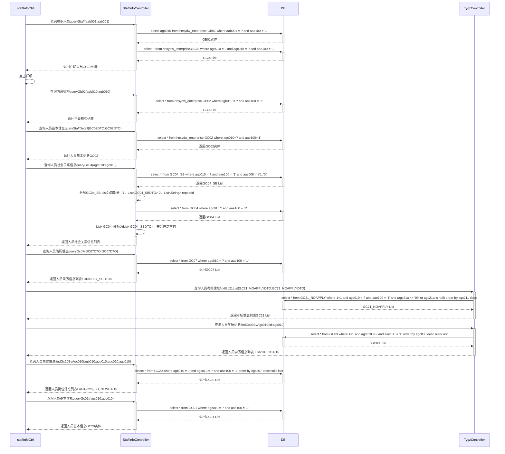

```mermaid
sequenceDiagram
    staffInfoCtrl->>+StaffInfoController:查询在职人员queryStaff{aab001:aab001}
    StaffInfoController->>+DB: select agb010 from hnsydw_enterprise.GB01 where aab001 = ? and aae100 = '1'
    DB-->>-StaffInfoController:GB01实体
    StaffInfoController->>+DB: select * from hnsydw_enterprise.GC02 where agb010 = ? and agc01b = ?  and aae100 = '1'
    DB-->>-StaffInfoController:GC02List
    StaffInfoController-->>-staffInfoCtrl:返回在职人员GC02列表

    staffInfoCtrl->>+staffInfoCtrl:点击详细

    staffInfoCtrl->>+StaffInfoController:查询内设机构queryGb02{agb010:agb010}
    StaffInfoController->>+DB:select * from hnsydw_enterprise.GB02 where agb010 = ? and aae100 = '1'
    DB-->>-StaffInfoController:GB02List
    StaffInfoController-->>-staffInfoCtrl:返回内设机构列表

    staffInfoCtrl->>+StaffInfoController:查询人员基本信息queryStaffDetail{GC02DTO:GC02DTO}
    StaffInfoController->>+DB:select * from hnsydw_enterprise.GC02 where agc010=? and aae100='1'
    DB-->>-StaffInfoController:返回GC02实体
    StaffInfoController-->>-staffInfoCtrl:返回人员基本信息GC02

    staffInfoCtrl->>+StaffInfoController:查询人员社会关系信息queryGc04{agc010:agc010}
    StaffInfoController->>+DB:select * from GC04_SB where agc010 = ? and aae100 = '1' and aaz008 in ('1','0') 
    DB-->>-StaffInfoController:返回GC04_SB List
    StaffInfoController-->>-StaffInfoController:分解GC04_SB List为两部分：1、List<GC04_SBDTO> 2、List<String> repeatId
    StaffInfoController->>+DB:select * from GC04 where agc010 ? and aae100 = '1'
    DB-->>-StaffInfoController:返回GC04 List
    StaffInfoController->>+StaffInfoController:List<GC04>转换为List<GC04_SBDTO>，并合并之前的
    StaffInfoController-->>-staffInfoCtrl:返回人员社会关系信息列表

    staffInfoCtrl->>+StaffInfoController:查询人员简历信息queryGc07{GC07DTO:GC07DTO}
    StaffInfoController->>+DB:select * from GC07 where agc010 = ? and aae100 = '1'
    DB-->>-StaffInfoController:返回GC07 List
    StaffInfoController-->>-staffInfoCtrl:返回人员简历信息列表List<GC07_SBDTO>

    staffInfoCtrl->>+TygzController:查询人员考核信息findGc21List{GC21_NOAPPLYDTO:GC21_NOAPPLYDTO}
    TygzController->>+DB:select * from GC21_NOAPPLY where 1=1 and agc010 = ? and aae100 = '1' and (agc21a <> '99' or agc21a is null) order by agc211 desc
    DB-->>-TygzController:GC21_NOAPPLY List
    TygzController-->>-staffInfoCtrl:返回考核信息列表GC21 List

    staffInfoCtrl->>+TygzController:查询人员学历信息findGc03ByAgc010{id:agc010}
    TygzController->>+DB:select * from GC03 where 1=1 and agc010 = ? and aae100 = '1' order by agc038 desc nulls last
    DB-->>-TygzController:GC03 List
    TygzController-->>-staffInfoCtrl:返回人员学历信息列表 List<GC03DTO>

    staffInfoCtrl->>+StaffInfoController:查询人员岗位信息findGc20ByAgc010{agb010:agb010,agc010:agc010}
    StaffInfoController->>+DB:select * from GC20 where agb010 = ? and agc010 = ? and aae100 = '1' order by cgc207 desc nulls last  
    DB-->>-StaffInfoController:返回GC20 List
    StaffInfoController-->>-staffInfoCtrl:返回人员岗位信息列表List<GC20_SB_NEWDTO>

    staffInfoCtrl->>+StaffInfoController:查询人员基本信息queryGc01t{agc010:agc010}
    StaffInfoController->>+DB:select * from GC01 where agc010 = ? and aae100 = '1'
    DB-->>-StaffInfoController:返回GC01 List
    StaffInfoController-->>-staffInfoCtrl:返回人员基本信息GC20实体


            
```