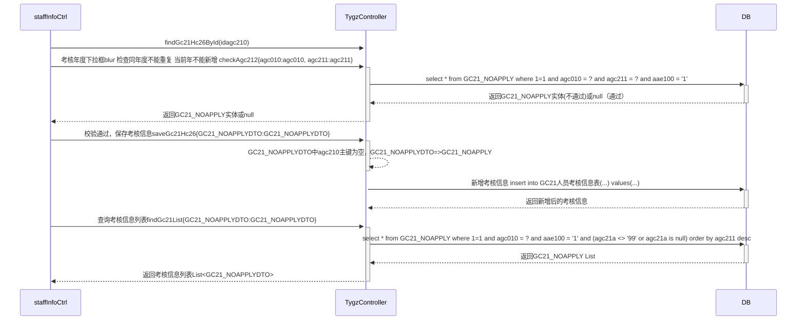

```mermaid
sequenceDiagram

    staffInfoCtrl->>+TygzController:findGc21Hc26ById(idagc210)
    staffInfoCtrl->>+TygzController:考核年度下拉框blur 检查同年度不能重复 当前年不能新增 checkAgc212{agc010:agc010, agc211:agc211}
    TygzController->>+DB:select * from GC21_NOAPPLY where 1=1 and agc010 = ? and agc211 = ? and aae100 = '1'
    DB-->>-TygzController:返回GC21_NOAPPLY实体(不通过)或null（通过）
    TygzController-->>-staffInfoCtrl:返回GC21_NOAPPLY实体或null

    staffInfoCtrl->>+TygzController:校验通过，保存考核信息saveGc21Hc26{GC21_NOAPPLYDTO:GC21_NOAPPLYDTO}
    TygzController-->>-TygzController:GC21_NOAPPLYDTO中agc210主键为空，GC21_NOAPPLYDTO=>GC21_NOAPPLY
    TygzController->>+DB:新增考核信息 insert into GC21人员考核信息表(...) values(...)
    DB-->>-TygzController:返回新增后的考核信息
    staffInfoCtrl->>+TygzController:查询考核信息列表findGc21List{GC21_NOAPPLYDTO:GC21_NOAPPLYDTO}
    TygzController->>+DB:select * from GC21_NOAPPLY where 1=1 and agc010 = ? and aae100 = '1' and (agc21a <> '99' or agc21a is null) order by agc211 desc
    DB-->>-TygzController:返回GC21_NOAPPLY List
    TygzController-->>-staffInfoCtrl:返回考核信息列表List<GC21_NOAPPLYDTO>
```