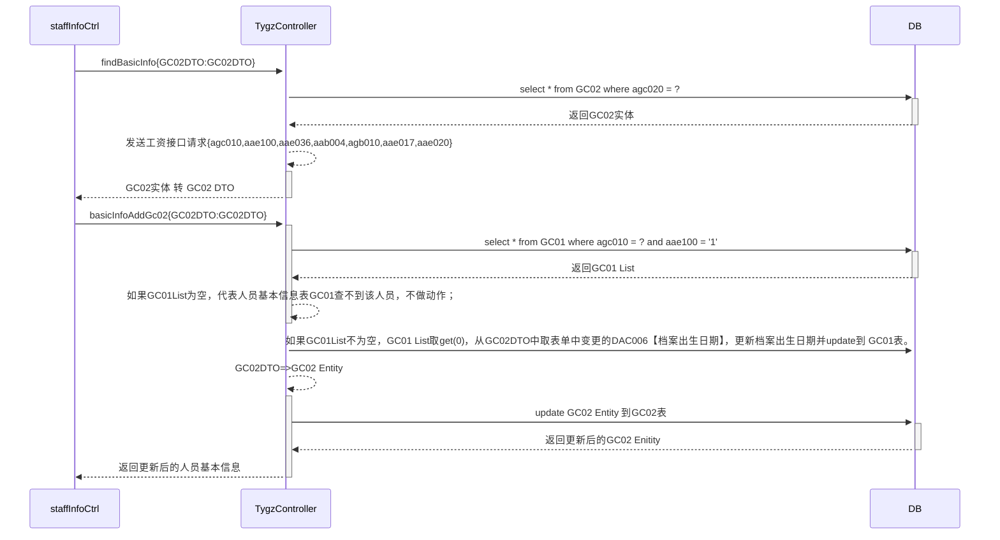

```mermaid
sequenceDiagram
    staffInfoCtrl->>+TygzController:findBasicInfo{GC02DTO:GC02DTO}
    TygzController->>+DB:select * from GC02 where agc020 = ?
    DB-->>-TygzController:返回GC02实体
    TygzController-->>+TygzController:发送工资接口请求{agc010,aae100,aae036,aab004,agb010,aae017,aae020}
    TygzController-->>-staffInfoCtrl:GC02实体 转 GC02 DTO

    staffInfoCtrl->>+TygzController:basicInfoAddGc02{GC02DTO:GC02DTO}
    TygzController->>+DB:select * from GC01 where agc010 = ? and aae100 = '1'
    DB-->>-TygzController:返回GC01 List
    TygzController-->>-TygzController:如果GC01List为空，代表人员基本信息表GC01查不到该人员，不做动作；
    TygzController->>+DB:如果GC01List不为空，GC01 List取get(0)，从GC02DTO中取表单中变更的DAC006【档案出生日期】，更新档案出生日期并update到 GC01表。
    TygzController-->>+TygzController:GC02DTO=>GC02 Entity
    TygzController->>+DB:update GC02 Entity 到GC02表
    DB-->>-TygzController:返回更新后的GC02 Enitity
    TygzController-->>-staffInfoCtrl:返回更新后的人员基本信息


```