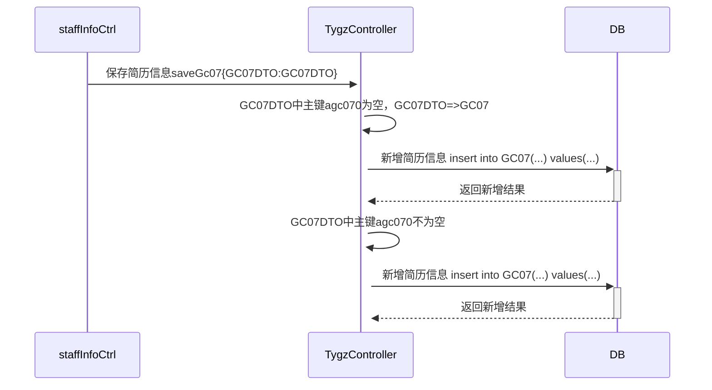

```mermaid
sequenceDiagram
    staffInfoCtrl->>+TygzController:保存简历信息saveGc07{GC07DTO:GC07DTO}
    TygzController->>+TygzController:GC07DTO中主键agc070为空，GC07DTO=>GC07
    TygzController->>+DB:新增简历信息 insert into GC07(...) values(...)
    DB-->>-TygzController:返回新增结果
    TygzController->>+TygzController:GC07DTO中主键agc070不为空
    TygzController->>+DB:新增简历信息 insert into GC07(...) values(...)
    DB-->>-TygzController:返回新增结果


            
```