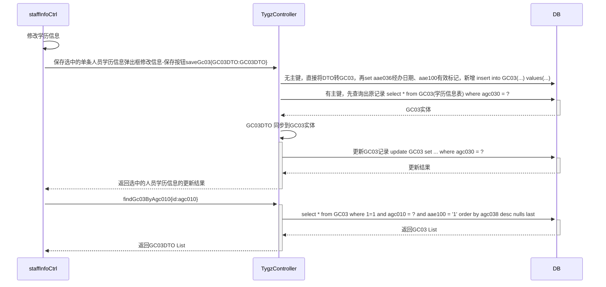

```mermaid
sequenceDiagram
    staffInfoCtrl->>+staffInfoCtrl:修改学历信息
    staffInfoCtrl->>+TygzController:保存选中的单条人员学历信息弹出框修改信息-保存按钮saveGc03{GC03DTO:GC03DTO}
    TygzController->>+DB:无主键，直接将DTO转GC03，再set aae036经办日期、aae100有效标记，新增 insert into GC03(...) values(...)
    TygzController->>+DB:有主键，先查询出原记录 select * from GC03(学历信息表) where  agc030 = ?
    DB-->>-TygzController:GC03实体
    TygzController->>+TygzController:GC03DTO 同步到GC03实体
    TygzController->>+DB:更新GC03记录 update GC03 set ... where agc030 = ?
    DB-->>-TygzController:更新结果
    TygzController-->>-staffInfoCtrl:返回选中的人员学历信息的更新结果
    staffInfoCtrl->>+TygzController:findGc03ByAgc010{id:agc010}
    TygzController->>+DB:select * from GC03 where 1=1 and agc010 = ? and aae100 = '1' order by agc038 desc nulls last
    DB-->>-TygzController:返回GC03 List
    TygzController-->>-staffInfoCtrl:返回GC03DTO List
```